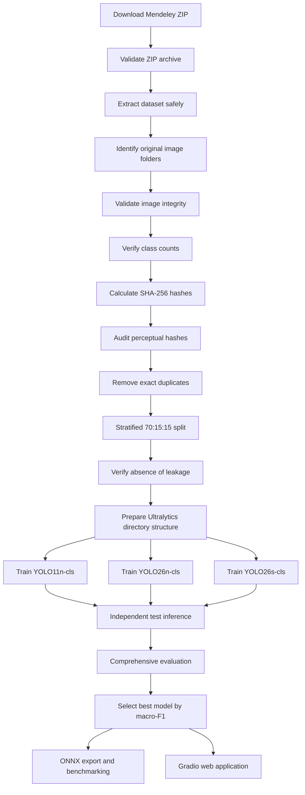

# RiceBorer-CLS

## Calibrated Ultralytics Classification and Web-Based Screening of Dead-Heart and White-Head Symptoms in Rice

[](https://www.python.org/)
[](https://docs.ultralytics.com/)
[](https://pytorch.org/)
[](https://www.gradio.app/)
[](https://data.mendeley.com/datasets/hnfjs42d5g/1)
[](https://doi.org/10.17632/hnfjs42d5g.1)
[](https://creativecommons.org/licenses/by/4.0/)

**Developer:** Partha Pratim Ray
**Institution:** Sikkim University, India
**Development date:** 31 July 2026

---

## Overview

**RiceBorer-CLS** is a reproducible deep-learning workflow for classifying visible symptoms in rice-plant images into three categories:

* **Healthy**
* **Dead Heart**
* **White Head**

The project uses pretrained Ultralytics image-classification models and evaluates their suitability for automated rice stem-borer symptom screening. It includes dataset auditing, duplicate detection, leakage-safe data partitioning, comparative transfer learning, calibration analysis, uncertainty-based referral, statistical model comparison, ONNX export, and an interactive Gradio application.

The workflow compares:

* `YOLO11n-cls`
* `YOLO26n-cls`
* `YOLO26s-cls`

The best-performing model is selected using **macro-F1 score**, followed by balanced accuracy and overall accuracy.

> This system classifies visible image symptoms. It does not directly detect insects or confirm that a particular stem-borer species caused the observed damage.

---

## Repository

```text
https://github.com/ParthaPRay/RiceBorer-CLS
```

### Google Colab notebook

[Open the original notebook in Google Colab](https://colab.research.google.com/drive/1Gz9Lb6EGjV7Z3SbSVxmE0Nz0mClWAFBG)

A CUDA-enabled GPU runtime, such as NVIDIA T4 or L4, is recommended. Standard Ultralytics training does not directly use a Colab TPU through the normal `device=0` setting.

---

## Research objective

The project investigates whether recent Ultralytics classification models can reliably distinguish healthy rice plants from two major visible stem-borer-associated symptom classes under natural field conditions.

The principal objectives are to:

1. create a quality-controlled image-classification dataset from the original field images;
2. prevent information leakage caused by duplicate or pre-augmented images;
3. compare recent Ultralytics classification architectures;
4. assess discrimination, class balance, calibration, uncertainty, and computational efficiency;
5. export the best model for deployment; and
6. provide a web-based demonstration for preliminary visual screening.

---

## Dataset

### Dataset title

**Symptom-Labeled Image Dataset of Rice Plants for Stem Borer Infestation Classification**

### Dataset source

* **Authors:** Chonchal Khan and Md Assaduzzaman
* **Repository:** Mendeley Data
* **Version:** 1
* **Published:** 27 May 2025
* **DOI:** [10.17632/hnfjs42d5g.1](https://doi.org/10.17632/hnfjs42d5g.1)
* **Dataset page:** https://data.mendeley.com/datasets/hnfjs42d5g/1
* **Institution:** Daffodil International University
* **Dataset licence:** CC BY 4.0
* **Download size:** approximately 1.55 GB

### Original image distribution

| Class      | Number of original images |
| ---------- | ------------------------: |
| Healthy    |                     1,106 |
| Dead Heart |                       439 |
| White Head |                       551 |
| **Total**  |                 **2,096** |

### Supplied augmented image distribution

| Class                      | Number of augmented images |
| -------------------------- | -------------------------: |
| Healthy                    |                      7,742 |
| Dead Heart                 |                      3,073 |
| White Head                 |                      3,857 |
| **Total augmented images** |                 **14,672** |

The complete original-plus-augmented dataset contains **16,768 images**.

### Image-acquisition details

* **Image type:** High-resolution RGB field images
* **Reported resolution:** 475 × 635 pixels
* **Capture device:** Realme 6 smartphone with a 64 MP camera
* **Collection period:** January–March 2025
* **Environmental conditions:** Sunny, cloudy, and windy weather
* **Capture times:** Morning, noon, and afternoon
* **Label verification:** Confirmed by a certified agricultural expert

### Collection locations

1. **Satrujitpur, Magura Sadar, Khulna, Bangladesh**
   23°25′07.0″ N, 89°29′20.0″ E

2. **Khajura, Bagherpara Upazila, Jessore, Khulna, Bangladesh**
   23.2764° N, 89.2538° E

### Dataset citation

```text
Khan, Chonchal; Assaduzzaman, Md (2025),
“Symptom-Labeled Image Dataset of Rice Plants for Stem Borer
Infestation Classification”, Mendeley Data, V1,
doi: 10.17632/hnfjs42d5g.1
```

---

## Important data-handling decision

The supplied augmented images are **not mixed into the validation or test partitions**.

Only the original field images are used to create the training, validation, and independent test sets. Online augmentation is applied exclusively during training.

This decision reduces the risk that transformed versions of the same source image appear in both model-development and evaluation partitions.

---

## Methodological workflow



---

## Data-quality controls

The notebook performs the following checks before training:

### Image integrity

Every image is opened and verified using Pillow. Corrupted or unreadable files are recorded separately.

### Dataset-count verification

Observed valid-image counts are compared with the numbers reported by the dataset creators.

### Exact duplicate detection

SHA-256 hashes are calculated for every image. Exact duplicate files are identified, and only one copy from each duplicate group is retained.

### Perceptual duplicate audit

Perceptual hashes are calculated to identify visually similar or potentially near-duplicate images.

### Leakage verification

The code confirms that:

* no SHA-256 hash occurs in more than one partition;
* no filepath appears in multiple partitions; and
* pre-augmented copies are excluded from validation and testing.

---

## Data partitioning

The cleaned original dataset is divided using a stratified split:

| Partition        | Proportion |
| ---------------- | ---------: |
| Training         |        70% |
| Validation       |        15% |
| Independent test |        15% |

The random seed is fixed at:

```python
SEED = 42
```

The prepared dataset follows the Ultralytics classification structure:

```text
prepared_dataset/
├── train/
│   ├── Healthy/
│   ├── Dead_Heart/
│   └── White_Head/
├── val/
│   ├── Healthy/
│   ├── Dead_Heart/
│   └── White_Head/
└── test/
    ├── Healthy/
    ├── Dead_Heart/
    └── White_Head/
```

---

## Models

Three pretrained Ultralytics image-classification models are compared:

| Experimental name | Initial checkpoint |
| ----------------- | ------------------ |
| YOLO11n-cls       | `yolo11n-cls.pt`   |
| YOLO26n-cls       | `yolo26n-cls.pt`   |
| YOLO26s-cls       | `yolo26s-cls.pt`   |

All checkpoints are used for transfer learning on the three-class rice symptom dataset.

---

## Training configuration

| Parameter                    | Value                           |
| ---------------------------- | ------------------------------- |
| Maximum epochs               | 25                              |
| Input image size             | 320 × 320                       |
| Early-stopping patience      | 8 epochs                        |
| Workers                      | 4                               |
| Training batch               | Automatically selected          |
| Optimizer                    | Ultralytics automatic optimizer |
| Initial learning rate        | 0.001                           |
| Final learning-rate fraction | 0.01                            |
| Weight decay                 | 0.0005                          |
| Warm-up epochs               | 3                               |
| Mixed precision              | Enabled                         |
| Cache mode                   | Disk                            |
| Pretrained weights           | Enabled                         |
| Deterministic mode           | Enabled                         |
| Random seed                  | 42                              |

Automatic batch selection is used to adapt training to available GPU memory.

---

## Online training augmentation

Augmentation is applied only to training images.

| Augmentation                |     Setting |
| --------------------------- | ----------: |
| Hue variation               |       0.015 |
| Saturation variation        |        0.30 |
| Value/brightness variation  |        0.30 |
| Rotation                    |        ±15° |
| Translation                 |         10% |
| Scale variation             |         20% |
| Shearing                    |          5° |
| Horizontal flip probability |        0.50 |
| Vertical flip probability   |        0.00 |
| Random erasing              |        0.20 |
| Automatic augmentation      | RandAugment |

The original validation and test images remain unaugmented.

---

## Evaluation framework

The notebook evaluates every trained model on the same independent test partition.

### Classification measures

* Accuracy
* Balanced accuracy
* Macro precision
* Macro recall
* Macro-F1
* Weighted precision
* Weighted recall
* Weighted F1
* Matthews correlation coefficient
* Cohen’s kappa

### Probability and discrimination measures

* Macro one-vs-rest AUROC
* Multiclass log loss
* Multiclass Brier score
* Expected calibration error
* Mean prediction confidence

### Computational measures

* Total inference time
* Milliseconds per image
* Images per second
* Model file size
* PyTorch inference speed
* ONNX inference speed

### Class-specific analyses

* Classification report
* Raw confusion matrix
* Row-normalized confusion matrix
* One-vs-rest ROC curves
* Correct and incorrect prediction examples
* High-confidence error patterns

---

## Model selection

The models are ranked using:

1. macro-F1;
2. balanced accuracy; and
3. overall accuracy.

```python
model_comparison_df = model_comparison_df.sort_values(
    ["Macro_F1", "Balanced_accuracy", "Accuracy"],
    ascending=False
)
```

The first-ranked model is automatically assigned as the final model:

```python
BEST_MODEL_NAME = model_comparison_df.iloc[0]["Model"]
BEST_MODEL_PATH = trained_model_paths[BEST_MODEL_NAME]
```

In the completed experiment, the Gradio application uses the trained **YOLO26s-cls** model.

---

## Calibration and uncertainty analysis

Accuracy alone does not indicate whether model probabilities are trustworthy. RiceBorer-CLS therefore includes calibration and confidence analyses.

### Expected calibration error

Predictions are divided into confidence bins, and the difference between mean confidence and observed accuracy is calculated.

### Multiclass Brier score

The Brier score measures the squared difference between predicted class probabilities and the true one-hot labels.

### Reliability diagram

The notebook produces a reliability diagram comparing:

* mean predicted confidence; and
* observed accuracy.

### Selective prediction

A confidence-based referral mechanism evaluates whether uncertain predictions should be withheld for expert review.

The analysis reports:

* confidence threshold;
* automatically accepted images;
* referred images;
* coverage;
* accuracy among accepted predictions; and
* selective risk.

The Gradio application uses the following interpretation:

| Confidence  | Interpretation                            |
| ----------- | ----------------------------------------- |
| ≥ 0.85      | High confidence                           |
| 0.70–0.8499 | Moderate confidence                       |
| < 0.70      | Low confidence; expert review recommended |

These thresholds are operational settings for the research prototype and are not agronomic intervention thresholds.

---

## Statistical comparison

Since all models are evaluated on the same test images, the workflow includes paired statistical tests.

### Cochran’s Q test

Cochran’s Q evaluates whether the compared classifiers have equal proportions of correct predictions.

### Pairwise exact McNemar tests

When model-level differences are investigated pairwise, exact McNemar tests are applied.

### Multiple-comparison correction

Holm correction is used to adjust pairwise p-values.

### Bootstrap confidence intervals

Two thousand bootstrap resamples are used to generate 95% confidence intervals for:

* accuracy;
* balanced accuracy;
* macro-F1; and
* Matthews correlation coefficient.

---

## Generated figures

All publication figures are exported at **600 dpi**.

The workflow generates:

1. class distribution;
2. representative original images;
3. image-dimension distribution;
4. train-validation-test distribution;
5. training-loss trajectories;
6. validation-accuracy trajectories;
7. comparative model performance;
8. normalized confusion matrix;
9. one-vs-rest ROC curves;
10. calibration curve;
11. accuracy-coverage relationship;
12. correct and incorrect prediction examples; and
13. accuracy-efficiency relationship.

The confusion matrix uses a light blue colour scale with dark annotations to maintain readability in print and on screen.

---

## Generated tables

The notebook exports CSV tables for:

* dataset verification;
* class distribution;
* representative-image metadata;
* image dimensions;
* partition distribution;
* training summary;
* training histories;
* independent test performance;
* class-specific performance;
* confusion-matrix counts;
* class-specific AUROC;
* calibration;
* selective prediction;
* Cochran’s Q;
* pairwise McNemar tests;
* bootstrap confidence intervals;
* prediction-error patterns;
* model size and speed;
* accuracy-efficiency analysis; and
* deployment-format benchmarking.

The tables are also consolidated into:

```text
rice_stem_borer_results_tables.xlsx
```

---

## ONNX export

The best model is exported using Ultralytics Export mode:

```python
best_model.export(
    format="onnx",
    imgsz=320,
    dynamic=True,
    simplify=True,
    opset=17
)
```

The resulting file is saved using a descriptive name:

```text
<best-model>_rice_stem_borer.onnx
```

The notebook subsequently benchmarks the PyTorch and ONNX formats on a common sample of test images.

---

## Gradio web application

The notebook includes an interactive Gradio interface that accepts an uploaded rice-plant image and returns:

* class probabilities;
* predicted class;
* prediction confidence;
* confidence category;
* model name;
* a basic interpretation; and
* an uncertainty and safety statement.

### Application output classes

```python
DISPLAY_NAMES = {
    "Healthy": "Healthy",
    "Dead_Heart": "Dead Heart",
    "White_Head": "White Head"
}
```

### Launch the application

Run the final Gradio cells in the notebook:

```python
demo.launch(
    share=True,
    debug=False,
    show_error=True
)
```

Gradio generates a temporary public URL when `share=True`.

> Temporary Gradio share links expire. For permanent deployment, use Hugging Face Spaces, a cloud service, or a locally hosted Gradio server.

---

## Installation

### Google Colab

The easiest method is to open the notebook in Google Colab and run the cells sequentially.

### Local environment

Clone the repository:

```bash
git clone https://github.com/ParthaPRay/RiceBorer-CLS.git
cd RiceBorer-CLS
```

Create a virtual environment:

```bash
python -m venv .venv
```

Activate it on Linux or macOS:

```bash
source .venv/bin/activate
```

Activate it on Windows:

```powershell
.venv\Scripts\activate
```

Install the required packages:

```bash
pip install --upgrade pip
pip install ultralytics torch torchvision
pip install scikit-learn pandas numpy matplotlib pillow
pip install imagehash gradio openpyxl pyarrow scipy statsmodels
```

A CUDA-capable GPU is recommended for training.

---

## Direct dataset download

The notebook downloads the dataset using its public Mendeley file URL:

```python
DATASET_URL = (
    "https://data.mendeley.com/public-files/datasets/"
    "hnfjs42d5g/files/"
    "6f46fe33-4cbb-44d1-a149-61dd3fe4eec7/"
    "file_downloaded"
)
```

The file is saved as:

```text
Stem Borer Infestation Dataset.zip
```

The download is validated as a ZIP archive before extraction.

---

## Quick prediction example

After training or downloading a compatible checkpoint:

```python
from ultralytics import YOLO

model = YOLO("best.pt")

results = model.predict(
    source="rice_image.jpg",
    imgsz=320
)

result = results[0]

predicted_index = int(result.probs.top1)
predicted_class = result.names[predicted_index]
confidence = float(result.probs.top1conf)

print("Predicted class:", predicted_class)
print("Confidence:", confidence)
```

---

## Suggested repository structure

```text
RiceBorer-CLS/
├── RiceBorer-CLS.ipynb
├── README.md
├── LICENSE
├── requirements.txt
├── app.py
├── models/
│   ├── README.md
│   └── best.pt
├── results/
│   ├── figures_600dpi/
│   ├── tables/
│   └── exports/
└── docs/
    └── methodology.md
```

Large model files and the 1.55 GB dataset should generally not be committed directly to the Git repository. They may instead be provided through:

* GitHub Releases;
* Git Large File Storage;
* Hugging Face Hub;
* Zenodo; or
* an external model repository.

---

## Reproducibility

The notebook stores the experiment configuration in:

```text
experiment_configuration.json
```

The saved metadata includes:

* dataset URL and DOI;
* dataset and prepared-data paths;
* class names;
* random seed;
* split proportions;
* model checkpoints;
* training settings;
* runtime device;
* CUDA and GPU information;
* Python version;
* PyTorch version; and
* Ultralytics version.

Although deterministic settings are enabled, small numerical differences may occur across hardware, CUDA, PyTorch, or Ultralytics versions.

---

## Limitations

1. **Image-level classification only**
   The model assigns one class to the entire image. It does not localize individual damaged stems or panicles.

2. **No direct insect detection**
   The model recognizes symptom patterns, not Yellow Stem Borer or Striped Stem Borer insects.

3. **Limited geographical domain**
   The source images were collected at two locations in Bangladesh.

4. **Single capture device**
   Images were captured using a Realme 6 smartphone.

5. **Internal rather than external validation**
   The independent test images originate from the same overall dataset as the training and validation images.

6. **Three-class closed-set model**
   Diseases, nutrient deficiencies, weather injury, and other rice conditions are not explicitly represented.

7. **No pesticide recommendation**
   The application must not be used independently to select pesticides or determine dosages.

8. **Indian deployment requires external validation**
   Independently collected images from Indian rice-growing regions should be tested before claiming suitability for operational use in India.

---

## Responsible use

RiceBorer-CLS is intended for:

* computer-vision research;
* educational demonstration;
* precision-agriculture experimentation;
* preliminary visual screening; and
* comparative evaluation of image-classification models.

It is not intended to replace:

* agricultural extension personnel;
* entomologists;
* plant pathologists;
* field scouting;
* laboratory diagnosis; or
* official crop-protection recommendations.

Users should seek expert confirmation before making crop-management decisions.

---

## Dataset acknowledgement

The developer acknowledges Chonchal Khan and Md Assaduzzaman for creating and publishing the rice stem-borer symptom image dataset through Mendeley Data under the CC BY 4.0 licence.

Dataset:

```text
Khan, Chonchal; Assaduzzaman, Md (2025),
“Symptom-Labeled Image Dataset of Rice Plants for Stem Borer
Infestation Classification”, Mendeley Data, V1,
doi: 10.17632/hnfjs42d5g.1
```

---

## Software acknowledgement

This project uses open-source software, including:

* [Ultralytics](https://github.com/ultralytics/ultralytics)
* [PyTorch](https://pytorch.org/)
* [scikit-learn](https://scikit-learn.org/)
* [Pandas](https://pandas.pydata.org/)
* [NumPy](https://numpy.org/)
* [Matplotlib](https://matplotlib.org/)
* [Pillow](https://python-pillow.org/)
* [Gradio](https://www.gradio.app/)
* [ImageHash](https://github.com/JohannesBuchner/imagehash)
* [SciPy](https://scipy.org/)
* [statsmodels](https://www.statsmodels.org/)

---

## Citation

A formal paper citation can be added after publication. Until then, the repository may be cited as:

```bibtex
@software{ray2026riceborercls,
  author       = {Ray, Partha Pratim},
  title        = {RiceBorer-CLS: Calibrated Ultralytics Classification
                  and Web-Based Screening of Dead-Heart and White-Head
                  Symptoms in Rice},
  year         = {2026},
  month        = {7},
  day          = {31},
  institution  = {Sikkim University},
  url          = {https://github.com/ParthaPRay/RiceBorer-CLS}
}
```

The dataset must be cited separately:

```bibtex
@dataset{khan2025stem_borer,
  author    = {Khan, Chonchal and Assaduzzaman, Md},
  title     = {Symptom-Labeled Image Dataset of Rice Plants for
               Stem Borer Infestation Classification},
  year      = {2025},
  publisher = {Mendeley Data},
  version   = {1},
  doi       = {10.17632/hnfjs42d5g.1},
  url       = {https://data.mendeley.com/datasets/hnfjs42d5g/1}
}
```

---

## Developer

**Partha Pratim Ray**
Sikkim University, India
31 July 2026

Repository: https://github.com/ParthaPRay/RiceBorer-CLS

---

## Contact and contributions

Suggestions, corrections, and reproducibility reports may be submitted through the repository’s:

* Issues;
* discussions; or
* pull requests.

When reporting a problem, include:

* Python version;
* Ultralytics version;
* PyTorch version;
* accelerator type;
* relevant error message; and
* the notebook cell where the problem occurred.
